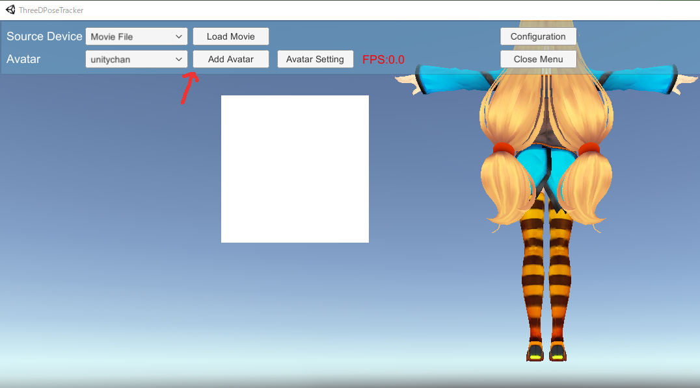
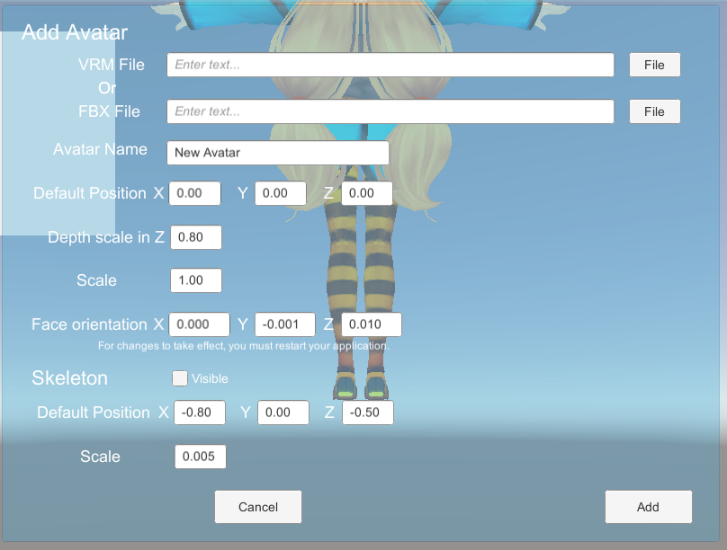

# ThreeDPoseTracker (preparing now)
## Install and Tutorial
### Download and put files
1. Download the zip file from the releases page and unzip it.

2. Download onnx from our home page by clicking following URL in our HP. 
   https://digital-standard.com/threedpose/models/HighQualityTrainedModel.nn
   
3. Move the downloaded HighQualityTrainedModel.nn file to ThreeDPoseTracker_Data/StreamingAssets in the unzipped folder. 

### How to Use
1. Since we haven't created an quit button yet, check Windowed in the first Configuration and press the Play button. 

2. When the window opens, select whether to use a video file or a USB camera from the Source device. 
　　Here is a sample movie file.(https://github.com/digital-standard/ThreeDPoseTracker/tree/master/SampleVideo)   
   If you connect a USB camera after starting the application, restart the application. 

3. Switch the trained model on the Configuration screen. Select high quality or low quality in the item of "Trained Model". High quality Model recommends GPU of GTX1070 or more. 
If it exceeds 100fps, please adjust LowPassFilter to about 0.5 on the Configuration screen

4. Select Avatar in the Avatar menu. You can add VRM Avatar on the "Add Avatar" screen. 
   Here is a sample VRM file.(https://github.com/digital-standard/ThreeDPoseTracker/tree/master/Avatars)
   FBX files are not yet available.

 
 
Upload the file from the "ADD Avatar" button. 
Avatar name: Avatar name 
Default position: Start position 
Depth scale in: Depth scale of depth movement ratio 
Scale: Avatar size 
Skeleton: Stickman Display 
Default position: Stickman start position 
Scale: Stickman size 

5. Use the "Close Menu" button to hide the menu. The menu is displayed again by pressing the space key.
While the menu is not displayed, you can change the camera angle by left-clicking the mouse and change the avatar by right-clicking.
 

## Source
Created with Unity ver 2019.2.12f1. 
We use Barracuda 0.4 to load onnx. 
By updating the version to 0.5, it seems like the speed get slower.  
Now we are still trying 0.5 version.  

Unity Standalone File Browser 1.2(https://github.com/gkngkc/UnityStandaloneFileBrowser) 

## Performance Report
### High Quality Trained Model  
GeForce RTX2060 SUPER ⇒ About 30 FPS  
GeForce GTX1070 ⇒ About 20 FPS  
### Low Quality Trained Model  
GeForce RTX2060 SUPER ⇒ About 60 FPS  

## License
・Non-commercial use only.Please use it freely for hobbies and research. Redistribution is prohibited. Please contact us if you want to use it for commercial purposes. 

・The videos named as "Action_with_wiper.mp4"(
original video: https://www.youtube.com/watch?v=C9VtSRiEM7s) and "onegai_darling.mp4"(original video: https://www.youtube.com/watch?v=tmsK8985dyk) contained in this code are not copyright free.
  So you should not use those of files in other places without permission.  
  
## Contact 
If you have any questions, please feel free to contact us from following URL. 
Contact form:  https://digital-standard.com/contact/  
E-Mail: info@digital-standard.com  

